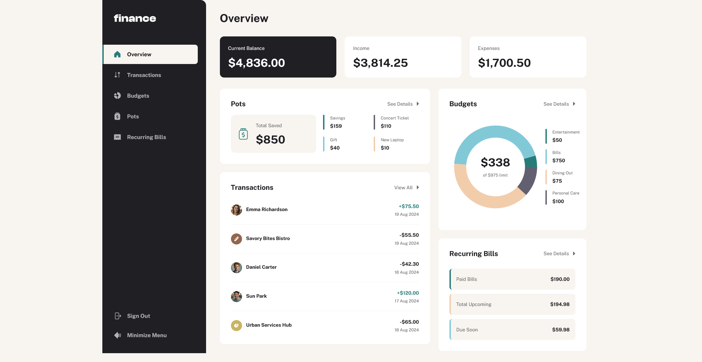
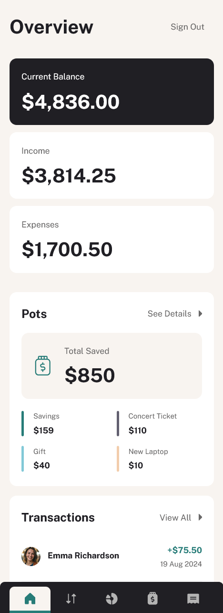

# Frontend Mentor - Personal finance app solution

This is a solution to the [Personal finance app challenge on Frontend Mentor](https://www.frontendmentor.io/challenges/personal-finance-app-JfjtZgyMt1). Frontend Mentor challenges help you improve your coding skills by building realistic projects.

## Table of contents

- [Overview](#overview)
  - [The challenge](#the-challenge)
  - [Screenshot](#screenshot)
  - [Links](#links)
- [My process](#my-process)
  - [Built with](#built-with)
  - [What I learned](#what-i-learned)
  - [Continued development](#continued-development)
- [Author](#author)

## Overview

### The challenge

Users should be able to:

- See all of the personal finance app data at-a-glance on the overview page
- View all transactions on the transactions page with pagination for every ten transactions
- Search, sort, and filter transactions
- Create, read, update, delete (CRUD) budgets and saving pots
- View the latest three transactions for each budget category created
- View progress towards each pot
- Add money to and withdraw money from pots
- View recurring bills and the status of each for the current month
- Search and sort recurring bills
- Receive validation messages if required form fields aren't completed
- Navigate the whole app and perform all actions using only their keyboard
- View the optimal layout for the interface depending on their device's screen size
- See hover and focus states for all interactive elements on the page
- **Bonus**: Save details to a database (build the project as a full-stack app)
- **Bonus**: Create an account and log in (add user authentication to the full-stack app)

### Screenshot





### Links

- Solution URL: [Add solution URL here](https://your-solution-url.com)
- Live Site URL: [Add live site URL here](https://your-live-site-url.com)

## My process

### Built with

- Semantic HTML5 markup
- CSS custom properties
- Flexbox
- Mobile-first workflow
- [React](https://reactjs.org/) - JS library
- [Tailwind css](https://tailwindcss.com/) - For styles
- [TanStack Query](https://tanstack.com/query/latest) - For data fetching and state management
- [Supabase](https://supabase.com/) - Backend & Database

### What I learned

During the first phase of this project, I focused on building a scalable core architecture and implementing the full CRUD logic for the Savings Pots module.

#### 🏛️ Core Architecture & UI Patterns

Before building specific pages, I established a robust foundation to ensure accessibility and code reusability across the entire app:

- **Compound Component Pattern:** I implemented a flexible Menu and Modal system. This allows for decoupled but synchronized sub-components, making the UI highly declarative.

- **Advanced Focus Management:** To meet WCAG standards, I developed custom **focus traps** and **focus restoration** logic. This ensures that when a user closes a "Withdraw" or "Edit" modal, their focus returns precisely to the button that triggered it.

- **Accessible Navigation:** Engineered a responsive navigation system using **React Router's `NavLink`** for automatic route tracking and a custom `NavIconWrapper` for accessible SVG rendering.

#### 💰 Savings Pots Module (Feature Implementation) (Mobile View & Core Logic)

The Pots page served as the primary testing ground for complex database interactions and financial logic:

- **Transactional CRUD Operations:** Beyond simple data fetching, I implemented logic for adding and withdrawing funds. This required ensuring that the database and the local UI state stay perfectly in sync.

- **TanStack Query & Cache Invalidation:** I utilized **Optimistic Updates** and smart cache invalidation. For example, updating a savings pot automatically triggers a background refetch of the global balance to ensure data integrity across the app.

- **Business Logic Validation:** Using **React Hook Form**, I enforced strict financial rules, such as:
  - Preventing "Withdraw" actions if the amount exceeds the current pot balance.
  - Ensuring each pot has a unique color tag to maintain visual clarity in the UI.

```jsx
// Example: Implementation of the Compound Component Pattern for Pots Management
<Menus.Menu>
  <Menus.Toggle id={id} />
  <Menus.List id={id}>
    <Modal.Open modalName={`edit-pot-${id}`}>
      <Menus.Button>Edit Pot</Menus.Button>
    </Modal.Open>
    <Modal.Open modalName={`delete-pot-${id}`}>
      <Menus.Button>Delete Pot</Menus.Button>
    </Modal.Open>
  </Menus.List>
</Menus.Menu>
```

#### 🛡️ Feedback & Safety Systems

- **Global Toast Notifications:** Integrated a context-based notification system to confirm successful "Money Added" or "Pot Created" actions.

- **Error Boundaries:** Implemented `ErrorFallback` components specifically for the data-heavy sections of the Pots page to handle potential Supabase connection issues gracefully.

#### 📊 Budgets Module (Mobile View & Core Logic)

The Budgets page is the analytical heart of the app, requiring complex data aggregation and visual representation.

- **Interactive Data Visualization:** I integrated the **Recharts library** to create a dynamic Donut Chart. This provides a high-level visual breakdown of spending across all categories.

- **Smart Spending Summary:** Developed a central summary component that calculates the total monthly limit vs. actual spent amount across all budgets. This data is dynamically updated and rendered both as a list and as a central label within the chart.

- **Cross-Page Deep Linking:** Implemented a "See All" navigation feature. When a user clicks to view details for a specific budget (e.g., "Food"), the app programmatically navigates them to the Transactions page with the corresponding **URL Search Params** pre-set, automatically filtering the transaction list.

- **Relational Data Mapping:** Engineered a complex join between `budgets` and `transactions` in Supabase to calculate real-time spending totals for each category.

- **Automated Context:** Designed a "Latest Transactions" preview for each budget card, showing only the three most recent entries to keep the mobile interface clean yet informative.

```jsx
// Example: The logic which I used to calculate total spent in number and percentage, remaining amount , latest three transactions for each budget category

const chartData = useMemo(
  () =>
    budgets?.map((budget) => {
      const {
        categories: { category: budgetCategory },
        theme,
        maximum,
        id,
      } = budget;

      const totalSpent = Math.abs(
        filterSpendingTransactionForCategory(transactions, budgetCategory)
          ?.filter((transaction) => {
            const { date } = transaction;

            const transactionDate = new Date(date);

            return (
              transactionDate.getMonth() === AUGUSTMONTH &&
              transactionDate.getFullYear() === YEAR2024
            );
          })
          .reduce((sum, cur) => sum + cur.amount, 0),
      );

      const remainingAmount = Math.max(maximum - totalSpent, 0);
      const percentageOfSpent = Math.min((totalSpent / maximum) * 100, 100);

      const latestTransactions = [
        ...(filterSpendingTransactionForCategory(
          transactions,
          budgetCategory,
        ) || []),
      ]
        ?.sort((a, b) => new Date(b.date) - new Date(a.date))
        .slice(0, 3);

      return {
        name: budgetCategory,
        value: totalSpent,
        fill: theme,
        id,
        maximum,
        remainingAmount,
        percentageOfSpent,
        latestTransactions,
      };
    }),
  [budgets, transactions],
);
```

### 🏠 Overview Module (Mobile Dashboard & Data Aggregation)

The Overview page acts as the central command center of the application, synthesizing data from four different domains into a unified mobile-first dashboard.

- **Holistic Data Orchestration:** Developed a "Global Loading & Error" pattern. By consolidating loading states from `useBalance`, `usePots`, and `useBudgetAnalytics`, I ensured a flicker-free initial render where all dashboard tiles reveal simultaneously once the core data is ready.

- **Intelligent Empty States:** Designed a standardized `EmptyMessage` system. When a new user has no data, the dashboard hides complex analytical components (like the Recharts PieChart) and replaces them with actionable empty states that maintain a consistent `min-height` to preserve the grid layout.

- **Dynamic Summary Tiles:** Engineered responsive balance cards that provide immediate visibility into Total Balance, Income, and Expenses, utilizing custom formatting helpers to handle currency display across varying screen widths.

- **Cross-Module Preview Logic:** Implemented "Subset Mapping" to show the most relevant data snippets—such as the top 4 savings pots or the 5 most recent transactions—providing a high-level snapshot without overwhelming the mobile viewport.

```jsx
// Example: Unified Error and Loading Orchestration for the Dashboard
const isLoading =
  isLoadingUser || isLoadingBalance || isLoadingPots || isLoadingAnalytics;

if (errorAnalytics || potsError || userError || balanceError)
  return (
    <ErrorWrapper>
      <ErrorDisplay
        error={
          errorAnalytics?.message || userError?.message || potsError?.message
        }
        onRetry={refetchAll}
      />
    </ErrorWrapper>
  );
```

### 💸 Transactions Module (Search, Filter & Pagination)

The Transactions page is the most data-intensive part of the app, requiring high-performance filtering, state management, and clear accessibility feedback.

- **Advanced Server-Side Filtering:** Leveraged **URL Search Params** as the "Source of Truth." By syncing the search input and category dropdown with the URL, I ensured that users can bookmark specific filtered views or share them easily.

- **Accessible UX & Screen Reader Support:** Integrated the `useGenerateAnnouncement` hook to provide real-time updates for assistive technologies. As users filter by category or type, a hidden `aria-live` region announces the number of results found, ensuring blind and low-vision users stay oriented.

- **Robust Search & Multi-Criteria Sorting:** Integrated a debounced search system and a custom sorting engine (Latest, Oldest, A-Z, etc.) that allows users to navigate hundreds of entries with 60fps performance on mobile devices.

- **Pagination & Slice Logic:** To maintain performance, I implemented client-side pagination logic that splits the transaction history into manageable chunks, reducing the DOM node count and improving mobile scroll performance.

```jsx
// Example: Implementation of the ARIA announcement logic for filtered results
const { announcement } = useGenerateAnnouncement({
  isLoading,
  count: transactions?.length,
  searchParams,
  selectedSortByLabel: selectedSortByOption?.label,
  generateAnnouncement: ({ count, searchTerm, sortLabel }) => {
    const hasSearch = Boolean(searchTerm?.trim());
    const isAllCategory = selectedCategory?.category === "All Transactions";
    const categoryText = isAllCategory
      ? "all categories"
      : `the ${selectedCategory?.category}`;
    const transactionText = `transaction${count === 1 ? "" : "s"}`;

    if (!count || Number(count) === 0) {
      return `No transactions found${hasSearch ? ` matching ${searchTerm} in ${categoryText}` : `in ${categoryText}`}. Try adjusting your search or filters.`;
    }

    if (hasSearch) {
      return `Found ${count} ${transactionText} matching "${searchTerm}" in ${categoryText}, sorted by ${sortLabel}`;
    }

    // Without search (normal browsing)
    return `Showing ${count} transactions in ${categoryText}, sorted by ${sortLabel}. Page ${currentPage} of ${pageCount}`;
  },
});
```

### 📅 Recurring Bills Module (Financial Forecasting & Accessibility)

The Recurring Bills page tracks temporal data, specifically focusing on monthly obligations and payment status.

- **Status-Driven UI Logic:** Engineered a sophisticated list rendering system where each bill displays its specific payment cycle using a `getOrdinal` helper (e.g., "Monthly-1st"). The UI uses conditional styling and icons (`SelectedIcon`, `BillDueIcon`) to visually distinguish between "Paid" and "Due Soon" statuses.

- **Aria-Live Announcements:** Implemented a custom accessibility hook, `useGenerateAnnouncement`, to provide real-time feedback whenever filters change, announcing the exact number of results and the current sort order.

- **Consolidated Bill Analytics:** Utilized a custom `useRecurringBillsAnalytics` hook to calculate aggregate totals for the "Total Bills" header and a detailed "Summary" card, which breaks down the count and currency total for paid, upcoming, and overdue obligations.

- **Dynamic Filtering & Sorting:** Integrated a `useSearchManager` hook to allow users to search bills by name or amount while simultaneously applying complex sort logic (Latest, Highest, A-Z) via a custom `useMemo` pipeline.

```jsx
// Example: Sorting and Filtering logic for the Recurring Bills list
const searchedRecurringBills = useMemo(() => {
  //filtered
  const filteredSearchResults = processedBills?.filter(
    (bill) =>
      bill.name.toLowerCase().includes(searchTerm.toLowerCase()) ||
      bill.amount.toString().includes(searchTerm),
  );

  //Sorted
  return filteredSearchResults?.sort((a, b) => {
    let compareValue = 0;

    if (value === "name")
      compareValue = a.name.localeCompare(b.name); // ascending a - z
    else if (value === "date")
      compareValue = a.dayOfMonth - b.dayOfMonth; //ascending oldest - newest
    else if (value === "amount") compareValue = a.amount - b.amount; // ascending smallest - biggest

    return compareValue * directionValue;
  });
}, [processedBills, searchTerm, directionValue, value]);
```

#### 📱 Responsive Evolution: Tablet & Desktop Views

Transitioning from a mobile-first design to a full-screen dashboard required a shift from stacked layouts to complex grid systems and persistent navigation.

- **Dynamic Side Navigation (`SideNav`):** I engineered a sophisticated sidebar that replaces the mobile bottom navigation on larger screens. This component features:
- **Animated State Management:** Implemented a "collapsed" and "expanded" state with smooth CSS transitions (`sidenav-transition`) to optimize screen real estate.
- **Visual Hierarchy:** Strategically placed primary navigation, secondary actions (Sign Out), and layout controls (Minimize Menu) to create a professional desktop "SaaS" feel.
- **Complex Layout Logic:** Used conditional Tailwind classes to handle visibility and width transitions without causing layout shifts in the main content area.

- **Adaptive Component Architectures:** Many components were refined to change their "personality" based on the viewport:
- **OverviewHeader:** Designed to dynamically hide/show the "Sign Out" button, moving it from a prominent header action on mobile to an integrated sidebar action on desktop.
- **Grid Orchestration:** Leveraged CSS Grid to transform the single-column dashboard into a multi-column layout on tablet and desktop, ensuring balance and readable line lengths for financial data.

#### 🔐 Authentication & Session Management

The final phase of the app involved securing user data and managing the lifecycle of a full-stack session:

- **Integrated Auth Logic:** Leveraged a custom `useLogout` hook across multiple entry points. This hook orchestrates a multi-step cleanup:
- **API Interaction:** Communicates with Supabase to invalidate the session.
- **Global Cache Purge:** Uses TanStack Query's `queryClient.removeQueries()` to ensure no sensitive financial data remains in the browser memory after sign-out.
- **Secure Routing:** Utilizes React Router's `replace: true` navigation to prevent users from "back-buttoning" into a protected route after logging out.

- **State-Aware UI Feedback:** Implemented a robust "Loading & Obscuring" pattern during authentication actions. When a user clicks "Sign Out":
- Interactive icons and text are hidden using `opacity-0`.
- A `SpinnerMiniContainer` is centered within the button's footprint to provide immediate visual confirmation while the API call is pending.
- Buttons are programmatically disabled to prevent "double-tap" mutation errors.

#### 🏗️ Refined Performance & Polish

- **Transition Performance:** Fine-tuned the `transition-all` and `duration-500` properties across the app to ensure that layout shifts between mobile, tablet, and desktop feel fluid rather than jarring.

```jsx
// Example: Implementation of the responsive Sign Out button logic in the SideNav
<button
  onClick={() => logout()}
  disabled={isLoading}
  className="relative flex items-center group w-full bg-transparent border-none"
>
  {/* The spinner is absolutely positioned to prevent layout jumps when text/icons hide */}
  {isLoading && (
    <div className="w-full flex items-center justify-center">
      <SpinnerMiniContainer />
    </div>
  )}

  {/* Icon and Text visibility toggled via opacity to maintain space in the layout */}
  <span
    className={`shrink-0 size-6 flex items-center justify-center ${isLoading ? "opacity-0" : "opacity-100"}`}
  >
    <SignOutIcon className="w-6 h-6" />
  </span>

  <span
    className={`text-preset-3 ml-4 ${isCollapsed || isLoading ? "opacity-0 pointer-events-none" : "opacity-100"}`}
  >
    Sign Out
  </span>
</button>
```

## Author

- Frontend Mentor - [@aemrobe](https://www.frontendmentor.io/profile/aemrobe)
- Twitter - [@Aemro112](https://www.twitter.com/Aemro112)
